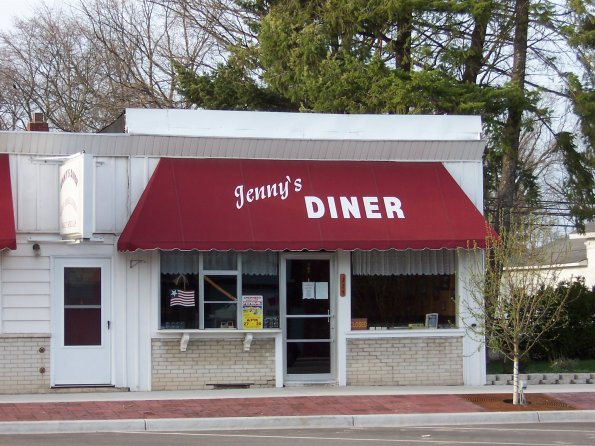

# Jenny's Diner Closing on April 2

_The Morning Sun_ reported on March 25 that [Jenny's Diner will be closing on April 2](http://www.themorningsun.com/general-news/20170325/jennys-diner-in-shepherd-closing-becoming-full-time-catering-service). It's owner, Jenny Packer, is closing the restaurant to focus "solely on catering orders full-time."

> On April 2, Jenny’s Diner will officially close its doors — marking the loss of another staple of the village of Shepherd. Brian Hanson, owner of Hanson’s Hardware, recently announced he was retiring and closing his store on April 25.

The article also covered Jenny Packer's history:

* She worked as a car hop waitress for Joy's Restaurant when she was younger
* Began working as a cook for Stan's Restaurant in Mount Pleasant starting in 1981
* In 2000, she purchased The Kitchenette in Shepherd, which was closing, and it became Jenny's Diner

The article noted that Jenny's Diner is one of two notable businesses which will be closing in April. The other, Hanson Hardware, will close April 25.

##Discussion
* How do you feel about the fact that Jenny's Diner will be closing?
* Share a photo or favorite memory from a time when you ate at Jenny's Diner
* _The Morning Sun_ said that "Along with filling the appetites of the locals over the years, Packer and the staff at Jenny’s Diner have been known to pull pranks on some of the regulars and have made many close friends - specifically with the older crowd." Have you been the target of or witnessed any of these practical jokes? Help tell the story about what happened.

_Respond in the comments, or send via email to [editor@shepherdhistory.org](mailto:editor@shepherdhistory.org)._
